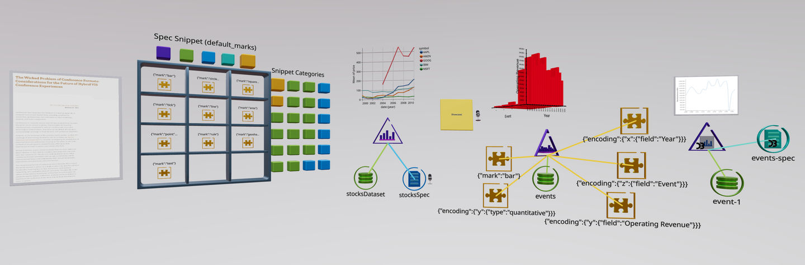

# DashSpace

> [!WARNING]
> This repository contains the first iteration of DashSpace that was released in the 2025 TVCG paper linked [below](#citation) and is no longer maintained. The updated and modularized version of DashSpace is part of the [Spatialstrates repository](https://github.com/Webstrates/Spatialstrates).

<p align="center">
    <a href="https://demo.webstrates.net/new?prototypeUrl=https://github.com/Webstrates/DashSpace/raw/main/prototypes/dash-space.zip" target="_blank"></a>
</p>


## About

DashSpace is a live collaborative platform for immersive and ubiquitous analytics. It builds on the Webstrates platform, including [Webstrates](https://www.webstrates.net/), [Codestrates](https://codestrates.projects.cavi.au.dk/), and [Varv](https://varv.projects.cavi.au.dk/). It uses [React Three Fiber](https://github.com/pmndrs/react-three-fiber/) and its [XR integration](https://github.com/pmndrs/xr) to render a 3D scene and utilize WebXR.


## Use

DashSpace can run on any Webstrates server. To setup your own Webstrates server see the [Webstrates documentation](https://webstrates.github.io/gettingstarted/installation.html).

To create an instance of DashSpace use the prototype ZIP file using the [HTTP API](https://webstrates.github.io/userguide/http-api.html) of Webstrates. The following link creates a copy on the public [demo.webstrates.net](https://demo.webstrates.net/) server:

> https://demo.webstrates.net/new?prototypeUrl=https://github.com/Webstrates/DashSpace/raw/main/prototypes/dash-space.zip

To create a copy on your own server replace the server address with your server:

```
https://your-webstrates-server.com/new?prototypeUrl=https://github.com/Webstrates/DashSpace/raw/main/prototypes/dash-space.zip
```

To overcome potential CORS issues, you can use a CDN:

```
https://your-webstrates-server.com/new?prototypeUrl=https://cdn.jsdelivr.net/gh/Webstrates/DashSpace@master/prototypes/dash-space.zip
```


## Documentation

Find the documentation in the [docs](docs) folder.


## Known Bugs and Limitations

### Performance

DashSpace is a research prototype and as such not optimized for performance. Especially in scene with many elements the performance can drop on slower devices.

With the v67 update of Meta Quest 3 OS and browser, performance detiorated considerably. We are unaware what caused this issue. We recommend using the `?dud=true` [URL parameter](docs/url-options.md) to disable avatars on the Meta Quest 2, 3, and Pro headsets.


### Stability

On the Meta Quest 3 and Pro headsets, we encountered crashes when switching between controllers and hand-tracking.


### Compatibility

We tested DashSpace on desktop (Windows, macOS) with a variety of browsers (Chrome, Edge, Safari), on Android using Chrome, and on the Meta Quest 3 and Pro headsets. On the Apple Vision Pro headset, WebXR does not yet support AR, but VR works with some rendering bugs.


## Attribution

### Models

DashSpace uses the following models from Sketchfab:

- [Quest 3](https://sketchfab.com/3d-models/quest-3-e5c334a9598c4e85bb182eebf15a2e32) by Redcodi
- [Action Camera - Low Poly](https://sketchfab.com/3d-models/action-camera-low-poly-b28bfbdfc62644beacf1e3c2c3423477) by xylvnking
- [Smartphone (Xperia Z Ultra) (School Project)](https://sketchfab.com/3d-models/smartphone-xperia-z-ultra-school-project-18a917d8619441b1ba46da856e43c43f) by Ole Gunnar Isager

The Meta Quest controller models were obtained from the [WebXR Input Profiles](https://github.com/immersive-web/webxr-input-profiles) repository.


### Vega-Lite Examples

Some of the example specifications and datasets that are included in the prototype version of DashSpace are taken or adapted from the [Vega-Lite example gallery](https://vega.github.io/vega-lite/examples/).


## Citation

[IEEE Xplore](https://doi.org/10.1109/TVCG.2025.3537679) · [Preprint PDF](https://pure.au.dk/ws/portalfiles/portal/418542389/TVCG_2025_DashSpace_Draft.pdf) · [Video Figure](https://www.youtube.com/watch?v=kyK20t7da8Q)

<details>
<summary><b>Abstract</b></summary>
We introduce DashSpace, a live collaborative immersive and ubiquitous analytics (IA/UA) platform designed for handheld and head-mounted Augmented/Extended Reality (AR/XR) implemented using WebXR and open standards. To bridge the gap between existing web-based visualizations and the immersive analytics setting, DashSpace supports visualizing both legacy D3 and Vega-Lite visualizations on 2D planes, and extruding Vega-Lite specifications into 2.5D. It also supports fully 3D visual representations using the Optomancy grammar. To facilitate authoring new visualizations in immersive XR, the platform provides a visual authoring mechanism where the user groups specification snippets to construct visualizations dynamically. The approach is fully persistent and collaborative, allowing multiple participants—whose presence is shown using 3D avatars and webcam feeds—to interact with the shared space synchronously, both co-located and remotely. We present three examples of DashSpace in action: immersive data analysis in 3D space, synchronous collaboration, and immersive data presentations.
</details>

```bibtex
@article{DashSpace2025,
    author    = {Borowski, Marcel and Butcher, Peter W. S. and Kristensen, Janus Bager and Petersen, Jonas Oxenbøll and Ritsos, Panagiotis D. and Klokmose, Clemens N. and Elmqvist, Niklas},
    title     = {DashSpace: A Live Collaborative Platform for Immersive and Ubiquitous Analytics},
    year      = {2025},
    journal   = {IEEE Transactions on Visualization and Computer Graphics},
    publisher = {IEEE Computer Society},
    doi       = {10.1109/TVCG.2025.3537679}
}
```
